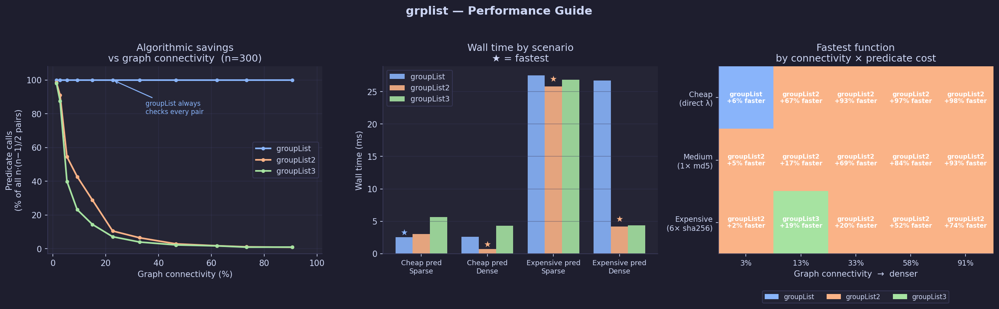

# grplist

Group list or dict items using an arbitrary comparison function. Items that
satisfy the predicate are placed in the same group, with transitivity applied
automatically — if A matches B and B matches C, all three end up together even
if A and C would not match directly.

```python
import grplist as gl

groups = gl.groupList([1, 3, 6, 10, 12, 14, 21, 35], lambda a, b: abs(a-b) <= 3, vals=True)
# => [[1, 3, 6], [10, 12, 14], [21], [35]]
```

---------------------------------------------------------------------

## Table of contents

* [Install](#install)
* [Quick start](#quick-start)
* [API reference](#api-reference)
* [Examples](#examples)
* [How it works](#how-it-works)
* [Comparison to similar projects](#comparison-to-similar-projects)
* [References](#references)

---------------------------------------------------------------------

## Install

```
pip install grplist
```

---------------------------------------------------------------------

## Quick start

```python
import grplist as gl

# Group numbers that are within 3 of each other
gl.groupList([1, 3, 6, 10, 12, 14, 21, 35], lambda a, b: abs(a-b) <= 3, vals=True)
# => [[1, 3, 6], [10, 12, 14], [21], [35]]

# Return indices instead of values (vals=False is the default)
gl.groupList([1, 3, 6, 10, 12, 14, 21, 35], lambda a, b: abs(a-b) <= 3)
# => [[0, 1, 2], [3, 4, 5], [6], [7]]

# Group a dict — returns groups of keys by default
d = {'a': 1, 'b': 3, 'c': 10, 'd': 12}
gl.groupDict(d, lambda a, b: abs(a-b) <= 3)
# => [['a', 'b'], ['c', 'd']]
```

---------------------------------------------------------------------

## API reference

All functions share the same signature pattern:

```
groupList(arr, fnc, vals=False)  -> list[list]
groupList2(arr, fnc, vals=False) -> list[list]
groupList3(arr, fnc, vals=False) -> list[list]
groupDict(obj, fnc, vals=False)  -> list[list]
groupDict2(obj, fnc, vals=False) -> list[list]
groupDict3(obj, fnc, vals=False) -> list[list]
```

### Parameters

| Parameter | Type | Description |
|-----------|------|-------------|
| `arr` / `obj` | `list` / `dict` | The collection to group |
| `fnc` | `callable(a, b) -> bool` | Returns `True` if two items belong in the same group |
| `vals` | `bool` | `True` → return item values; `False` (default) → return indices (list) or keys (dict) |

### Return value

A list of groups. Each group is a list of either values (when `vals=True`) or
indices/keys (when `vals=False`).

### Choosing between `groupList`, `groupList2`, and `groupList3`

All three produce equivalent results for symmetric, transitive predicates.
The differences are performance characteristics:

- **`groupList`** — compares every pair of items (O(n²) predicate calls). Simple
  and straightforward.
- **`groupList2`** — compares each new item only against existing group members,
  skipping pairs that cannot bridge groups. Makes fewer predicate calls when
  groups are sparse or the predicate is expensive.
- **`groupList3`** — uses [Union-Find](https://en.wikipedia.org/wiki/Disjoint-set_data_structure)
  with path-halving compression and union-by-rank. Reduces the bookkeeping
  around each merge from O(n) to O(α(n)) (effectively constant), and skips
  predicate calls for pairs already in the same component (saving 50–90% of
  calls on dense graphs). **Best when the predicate is expensive** (I/O,
  complex computation, ML inference). For cheap Python expressions, the two
  `find()` loops add more overhead than the predicate calls they save, making
  `groupList2` the faster choice in practice.

`groupDict` and `groupDict2` are thin wrappers that extract the dict's values,
delegate to `groupList` / `groupList2`, and then remap indices back to keys.

---------------------------------------------------------------------

## Examples

### Numeric proximity

```python
import grplist as gl

# Items within 3 of each other (values)
gl.groupList([1, 3, 6, 10, 12, 14, 21, 35], lambda a, b: abs(a-b) <= 3, vals=True)
# => [[1, 3, 6], [10, 12, 14], [21], [35]]

# Note: 7 bridges what would otherwise be two separate groups
gl.groupList([1, 3, 6, 10, 12, 14, 21, 35, 7, 23], lambda a, b: abs(a-b) <= 3, vals=True)
# => [[1, 3, 6, 10, 12, 14, 7], [21, 23], [35]]
```

### Grouping by shared characters

```python
import grplist as gl

def shares_a_letter(a, b):
    return any(c in b for c in a)

words = ['on', 'tw', 'th', 'fo', 'fi', 'si', 'te', 'zk']
gl.groupList2(words, shares_a_letter, vals=True)
# => [['on', 'fo', 'fi', 'si'], ['tw', 'te', 'th'], ['zk']]
```

### Grouping dict items by value

```python
import grplist as gl

scores = {'alice': 91, 'bob': 88, 'carol': 74, 'dave': 76, 'eve': 95}

# Group people whose scores are within 5 points of each other
gl.groupDict(scores, lambda a, b: abs(a-b) <= 5)
# => [['alice', 'bob', 'eve'], ['carol', 'dave']]

# Return the score values instead of names
gl.groupDict(scores, lambda a, b: abs(a-b) <= 5, vals=True)
# => [[91, 88, 95], [74, 76]]
```

### Grouping objects with a custom predicate — overlapping time ranges

```python
import grplist as gl

tracks = [
    {'start': 2,  'end': 10},
    {'start': 8,  'end': 17},
    {'start': 4,  'end': 7},
    {'start': 20, 'end': 25},
    {'start': 22, 'end': 28},
    {'start': 30, 'end': 45},
]

def overlaps(a, b):
    return a['start'] <= b['end'] and a['end'] >= b['start']

groups = gl.groupList2(tracks, overlaps, vals=True)
# Group 1: tracks 0, 1, 2  (2-10, 8-17, 4-7 all overlap)
# Group 2: tracks 3, 4     (20-25, 22-28 overlap)
# Group 3: track 5         (30-45, no overlap with others)
```

---------------------------------------------------------------------

## How it works

### The underlying problem: connected components

`grplist` solves the **connected components** problem from graph theory. Given
your list of items, think of each item as a node in an undirected graph. Your
comparison function `fnc(a, b)` defines the edges: an edge is drawn between
two nodes whenever `fnc` returns `True`. The groups returned by `grplist` are
the **connected components** of that graph — the clusters of nodes that are
reachable from each other through any chain of edges.

This naturally handles transitivity. If item A connects to item B, and item B
connects to item C, then A, B, and C all end up in the same group — even if
`fnc(A, C)` would return `False`.

A classic illustration: grouping integers where any two values within 3 of each
other are connected.

```
Items:  1 — 3 — 6     10 — 12 — 14     21     35
                  \   /
              (gap > 3)

Components:  [1, 3, 6]   [10, 12, 14]   [21]   [35]
```

If we add `7` to the list, it sits within 3 of both `6` and `10`, acting as a
bridge that merges the first two components:

```
Items:  1 — 3 — 6 — 7 — 10 — 12 — 14     21 — 23     35

Components:  [1, 3, 6, 7, 10, 12, 14]   [21, 23]   [35]
```

### `groupList` — union-find style

`groupList` performs a complete O(n²) pairwise scan. Each item is assigned a
group ID, and when two items with different IDs are found to match, their groups
are merged by renumbering. This is conceptually similar to a
[Union-Find / Disjoint Set Union](https://en.wikipedia.org/wiki/Disjoint-set_data_structure)
data structure, without path compression.

### `groupList2` — greedy linked-list merge

`groupList2` maintains a linked list for each group and processes items
one at a time. Each new item is compared against the members of every existing
group. If it matches more than one group, those groups are merged. This avoids
re-comparing items that are already in the same group, reducing predicate calls
at the cost of more bookkeeping.

### Performance guide



The three panels above show:

1. **Algorithmic savings** — `groupList` always calls the predicate for every
   pair. `groupList2` and `groupList3` both reduce calls as connectivity grows,
   with `groupList3` making the steepest drop (down to just `n−1` calls when
   every item connects to every other).

2. **Wall time by scenario** — the star marks the fastest function in each
   condition. For cheap predicates `groupList2` dominates; for expensive
   predicates on dense graphs `groupList3` pulls ahead.

3. **Winner heatmap** — which function is fastest at every combination of graph
   connectivity and predicate cost.  `groupList` (blue) wins only on very sparse
   graphs with a trivially cheap predicate; `groupList2` (orange) is the general
   winner for cheap predicates; `groupList3` (green) takes over as the predicate
   becomes more expensive and the graph grows denser.

To regenerate the chart after changing the code:

```
pip install matplotlib numpy
python bench/generate_charts.py
```

### Further reading

- [Connected components (graph theory)](https://en.wikipedia.org/wiki/Component_(graph_theory)) — Wikipedia
- [Disjoint-set data structure (Union-Find)](https://en.wikipedia.org/wiki/Disjoint-set_data_structure) — Wikipedia
- [Single-linkage clustering](https://en.wikipedia.org/wiki/Single-linkage_clustering) — Wikipedia (the ML framing of the same problem)

---------------------------------------------------------------------

## Comparison to similar projects

Several other libraries solve the same underlying problem. The right choice
depends on your data types, scale, and what else you need to do with the
results.

### NetworkX — `nx.connected_components(G)`

[NetworkX](https://networkx.org/) is the standard Python graph library. To
replicate `grplist`, you build a `Graph` object, call your predicate for every
pair of items to add edges, then call `nx.connected_components(G)`. This gives
you full connected-component detection backed by a mature, well-tested library.
The result is a generator of sets of node labels rather than grouped sub-lists,
so a small amount of post-processing is needed to get the same output shape.
NetworkX carries substantial dependencies (NumPy, and optionally SciPy) and is
heavyweight for this single task, but it pays off when you need additional graph
analysis — shortest paths, centrality, community detection, etc.

**Best for:** Projects already using NetworkX, or any case where connected
components is one step in a broader graph analysis pipeline.

### SciPy — `scipy.sparse.csgraph.connected_components`

[SciPy's graph module](https://docs.scipy.org/doc/scipy/reference/sparse.csgraph.html)
provides a fast, C-backed connected-components implementation that operates on
a sparse adjacency matrix. For large numerical datasets it significantly
outperforms `grplist`, but you must first express your predicate as a numeric
matrix, which requires your items to be representable as indices. Non-numeric
or heterogeneous objects need a manual encoding step. The result is a NumPy
label array rather than grouped sub-lists.

**Best for:** Large numerical datasets (thousands of items or more) where
performance matters and items can be naturally represented as a matrix.

### scikit-learn — `AgglomerativeClustering(linkage='single')`

[scikit-learn's single-linkage clustering](https://scikit-learn.org/stable/modules/generated/sklearn.cluster.AgglomerativeClustering.html)
is mathematically equivalent to connected components when the distance threshold
is set to match your grouping criterion. However, it requires a numeric distance
metric (or a precomputed distance matrix) rather than an arbitrary boolean
predicate — you cannot pass in a function that operates on strings, dicts, or
custom objects without first embedding them in a numeric space. Results come
back as a flat integer label array. It also requires specifying the number of
clusters or a distance threshold in advance, and pulls in the full scikit-learn
dependency.

**Best for:** Metric-based clustering problems that are already part of a
machine learning or data science pipeline using scikit-learn.

### disjoint-set — PyPI package `disjoint-set`

The [`disjoint-set`](https://pypi.org/project/disjoint-set/) package is a
clean, lightweight Union-Find / Disjoint Set Union implementation with proper
path compression and union-by-rank. It is algorithmically more efficient than
`grplist` for large inputs and supports incremental / streaming use (you can
call `union` at any time). The tradeoff is that it exposes a data structure
rather than a one-call function — you write the iteration loop yourself:

```python
from disjoint_set import DisjointSet
ds = DisjointSet()
for i, a in enumerate(items):
    for j, b in enumerate(items):
        if i < j and predicate(a, b):
            ds.union(a, b)
groups = ds.itersets()
```

This gives full control, but `grplist` is more convenient when you just want
to hand over a list and get groups back.

**Best for:** Performance-critical code, incremental/streaming grouping, or
when you want to manage the data structure directly.

### Summary table

| | **grplist** | **NetworkX** | **SciPy csgraph** | **scikit-learn** | **disjoint-set** |
|---|---|---|---|---|---|
| One-call API (list in, groups out) | Yes | No | No | No | No |
| Accepts arbitrary boolean predicate | Yes | With a loop | With a loop | No | With a loop |
| Works with any Python object | Yes | Yes | No | No | Yes |
| Returns grouped sub-lists directly | Yes | No (sets) | No (label array) | No (label array) | No (itersets) |
| No external dependencies | Yes | No | No | No | Yes |
| Efficient at n > 10,000 | No (O(n²)) | Yes | Yes | Yes | Yes |
| Full graph analysis capabilities | No | Yes | Partial | No | No |

**In summary:** `grplist` is the right choice when you want a single function
call, your predicate is arbitrary (non-numeric, custom objects, strings, etc.),
your list has at most a few thousand items, and you do not want to pull in
external dependencies. For larger inputs, or when you are already working
within NetworkX, SciPy, or scikit-learn, those tools will serve you better.

---------------------------------------------------------------------

## References

- [Connected components — Wikipedia](https://en.wikipedia.org/wiki/Component_(graph_theory))
- [Disjoint-set data structure — Wikipedia](https://en.wikipedia.org/wiki/Disjoint-set_data_structure)
- [Single-linkage clustering — Wikipedia](https://en.wikipedia.org/wiki/Single-linkage_clustering)
- [NetworkX](https://networkx.org/)
- [SciPy sparse graph routines](https://docs.scipy.org/doc/scipy/reference/sparse.csgraph.html)
- [scikit-learn AgglomerativeClustering](https://scikit-learn.org/stable/modules/generated/sklearn.cluster.AgglomerativeClustering.html)
- [disjoint-set on PyPI](https://pypi.org/project/disjoint-set/)
